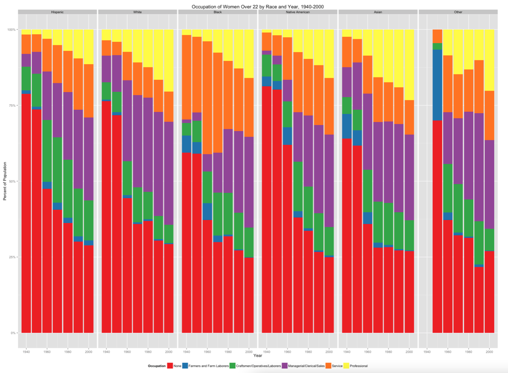

# Critique by Design
In this assignment, we selected a visualization to critique and then did so using Stephen Few's Data [Data Visualization Effectiveness Profile](http://www.perceptualedge.com/articles/visual_business_intelligence/data_visualization_effectiveness_profile.pdf). We then created a sketch or wireframe of the new visualization, and then solicited feedback on it. The final step was to created a new version of the visualization.

## Step 1: Selecting a Visualization
I found myself drawn to data on women's education and employment, and came across some interesting infographics and visualizations. This one caught my eye in part because it uses color in a way that is very loud, and also in part because I was curious what someone could say with it. I found myself fascinated by the idea of portraying multiple variables over time - in this case, occupation types and racial identity of women across several decades. After some time looking at this visualization, I had to look at the written commentary that went with it in order to understand the point that the author was making. I found myself thinking that there should be a way to create those takeaways visually, which made me want to use this graphic for this assignment.

I did run into some data snafus, and as such took a bit of license with the dates depicted by the graphic. I was unable to find the census data cited in the visualization, but I was able to find datasets from 30 years apart that were similarly aggregated. Even with the datasets I found, I had to do extensive data cleaning and sorting to be able to build a solution that clearly showed the takeaways that the original visualization's author described in the written portion of their website. This is why you'll notice that the original visualization depicts from 1940-2000, and my version depicts from 1990 to 2020.

Source: ["Women, Marriage, Education, and Occupation in the United States from 1940-2000"](https://journeys.dartmouth.edu/censushistory/2016/11/03/women-marriage-and-education-in-the-united-states-from-1940-2000/) (A link to just the visualization can be found [here](https://cpb-us-e1.wpmucdn.com/journeys.dartmouth.edu/dist/0/682/files/2016/11/occ2.png).)

## Step 2: Critiquing the Visualization
My first reaction when I saw this visualization was to blink, because the colors are very overwhelming. Other than needing a redesign for its color, another conclusion from the critique was that the type of chart chosen here does not effectively communicate the conclusions that the author writes about. I think the author likely found all of this data important - which it is - and focused more on getting all of the data onto the screen rather than emphasizing takeaways. I also found that irrespective of the audience, this visualization would not be effective.

## Step 3: Wireframing a Solution
I spent a lot of time on finding data after the original data source did not work, and as such spent a lot of time thinking about how the data should be structured, aggregated, and implemented. I found it hard to show even a portion of the data that was shown in the original visualization without being overwhelmed, so I started breaking out the takeaways and ended up with a panel of visualizations that each depict one of the takeaways described in the article.

I ended up using data from [here](https://www2.census.gov/library/publications/decennial/1990/cp-1/cp-1-1.pdf) and [here](https://www.bls.gov/cps/cpsaat09.htm) for 1990 and 2020 respectively. I also used [this page](https://www.bls.gov/cps/cpsaat11.htm) to interpolate race for the data from 2020 since it was not already aggregated in the same manner as that from 1990.

## Step 4: Testing the Solution
 I solicited feedback on this wireframe from 3 people, which was helpful. The first person was caught up with both the lack of color and my poor handwriting, so I preempted the second and third person with those two aspects and found their feedback to be more useful as it went beyond the simplistic limitations of the wireframe method I chose.

Person 1 answered similarly to questions asking what the visualization is and what it was telling them. They stated that they thought it was depicting how women are employed in various fields over time, and that it was telling them that there have been changes in the way women have been employed over time by race. They were not surprised by anything, found the lack of color confusing, and thought that the intended audience was equal employment employers.

Person 2 said that they thought the graphic was showing increased women's role in professional roles over time. Their main takeaway for what the graphic was telling them was that the last 30 years have been good to women. They thought that the intended audience was women who were angry about the lack of progress in the workplace, and they didn't find anything confusing but commented that the takeaways of the far left graphics could be emphasized by changing the type of chart since they depicted something different than the two bar charts on the right side of the panel.
 
Person 3 said that they thought the graphic symbolized change over time for women's role in society. They thought it was telling them that there are more women involved in professional roles now than there were in 1990. They thought the intended audience was women generally but not men because it was a stark depiction of a trend that still shows improvement needed for women, and they didn't think men would be receptive if it were presented to them in this way. They suggested using a Sankey diagram for the trends depicted in the left portion of the panel.

All three people immediately recognized that this visualization was depicting changes in women's employment over time, and were able to quickly and clearly articulate the specifics of those trends. I was interested by their responses to the intended audience question, and I appreciated the feedback about changing the type of the left charts.
 
## Step 5: Building the Solution

My redesigned data visualization shows four trends that the author emphasized in the article: (1) the increase over time of women in professional roles; (2) the changes over time in women's employment in professional roles by race; (3) change over time in women's employment in service roles by race; (4) the reduction of women with no occupation over time. I selected a panel of bar and column charts because the author focused on comparison and trends over time, with an emphasis on the numbers and the breakdown by race. I felt that the best way to demonstrate these trends was to spread the visualization out into several different ones that fall into familiar depiction patterns like bar charts. One tradeoff of my method is that there is less data depicted, and that my visualizations take up much more space than that of the original author. If space were a constraint, my method would not be considered effective despite its emphasis on the trends described by the author. However, I find it clear that I was able to communicate trends that were not easily visible in the original visualization, wihch was reinforced by my user feedback. I was happy that I was able to do at least part of what I intended in my remake of this visualization.

One drawback I found in using Flourish was that the graphics were not easily re-sizeable. As such, even though I drew a panel of four in my wireframe, I ended up with a set of four separate but complimentary visualizations. I chose a color palate using [Colorbrewer](https://colorbrewer2.org/#type=qualitative&scheme=Set2&n=6) so that it was clear that these were interlinked graphs but that they each represented a different conclusion.

#### Solution Sources:
[1990 Census Data](https://www2.census.gov/library/publications/decennial/1990/cp-1/cp-1-1.pdf)
[2020 Census Data by Age and Occupation](https://www.bls.gov/cps/cpsaat09.htm)
[2020 Census Data by Race](https://www.bls.gov/cps/cpsaat11.htm)

### Notes
If you'd like to return to my main page, you can do so [here](/README.md).
