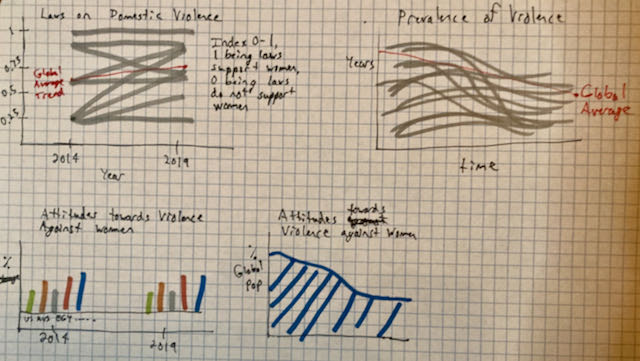
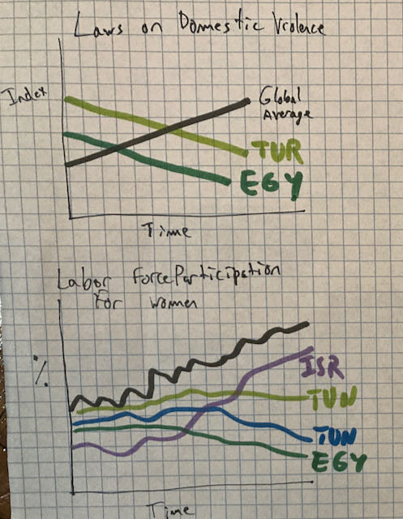
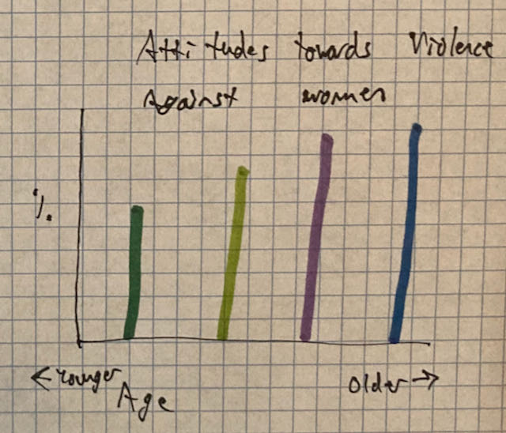

# Final Project, Part 1
This assignment structures, outlines, and describes the final project.

## Project Outline
My project aims to emphasize the importance of changing laws surrounding women's rights, especially with regards to violence against women, in the Middle East. To do so, the project highlights differences in global and regional trends on laws and attitudes towards violence against women, as well as examining the correlation between the level of conflict versus the level of violence against women in particular countries. 

## Project Structure
### Setup: 
- Women's rights are improving globally
- Women's labor force participation is increasing over time
- Attitudes condemning violence against women are increasing 
### Conflict: 
- Unfortunately, they are not improving at the same rate everywhere
- The Middle East is not improving at a level that is equivalent to the global average
- Some countries in the Middle East have even had a decreased trend 
### Resolution: 
- This can get better! 
- Laws must be updated 
- Preexisting laws that were crafted to protect women need to be enforced appropriately

## Initial sketches
### Setup: 
#### Potential Header: Attitudes, Laws, and Prevalence of Violence Against Women Across the Globe
 
In these sketches, I'd like to depict the global trends of some of the data that I'm using. I know I need to iterate on these more because so far most of my sketches have been bar or line charts, although I did try an area chart here. The idea in this section of the project, as outlined above, is that I will lay out the wider context about attitudes, laws, and prevalence of violence against women.
### Conflict: 
#### Potential Header: The Middle East Lags Behind
 
In the conflict section, I want to depict how the Middle East is not changing at an equivalent pace to the rest of the globe. At this point I intend to start filling in details with words about laws in the Middle East and focusing in on particular countries to demonstrate how they compare globally.
## Potential Header: Conflict and Violence Against Women in Yemen and Egypt
This is not sketched yet, but I intend to have a section of the project dedicated towards exploring the trends of conflict and violence against women at a country level.
### Resolution: 
#### Potential Header: Change Awaits
 
In this sketch I wanted to show something positive - that attitudes about violence against women are better in the younger generation, for instance. I don't know that the data support this specific sketch, but I intend to use this section to both drive home my call to action and to offer some encouragement for change.

## Project Data
The first data source I'm using is the [OECD Gender Portal](https://www.oecd.org/gender/data/), which has a fairly extensive (if not current) database. Within this database, I've focused in on a particular dataset that depicts attitudes towards domestic violence, laws against domestic violence, and the prevolence of domestic violence over someone's lifetime. This is uploaded already to this repository and can be accessed [here](Gen_Vio_Data_OECD.csv). Even though there are only two years in this dataset - 2014 and 2019 - it's a great source of data for a number of Middle Eastern countries. It also contains enough countries from around the world to create good baseline trends of change from 2014 to 2019, which as discussed above is part of my project structure.

The second source data source I'm using is from [World Bank Gender Statistics](https://databank.worldbank.org/source/gender-statistics/), which has data on labor force participation broken down by gender. The global data can be found in my repository [here](labor_force_global.csv) while the data for just Middle Eastern countries can be found [here](labor_force_me.csv). This data is somewhat tangential to the topic of violence against women, but I find that it gives further context to the broad situation of women in the Middle East. 

The third data source I'm using to highlight conflict is [ACLED](https://acleddata.com/#/dashboard), or the Armed Conflict Location & Event Data Project. This is an extensive database that collects and georectifies data on conflict around the world. So far I've only examined overarching trends of the data, but intend to aggregate conflict events per country per year in order to compare them with data on attitudes and laws about violence against women. The data for 2019 is in my repository and can be found [here](acled_me_2019.csv.zip).

I'll be using the OECD gender data to depict how attitudes have changed from 2014 to 2019. I found that even across the three subsets of the data - attitudes, laws, and prevalence of violence towards women - there is not consistency in which Middle Eastern countries appear in the dataset. As such, I will likely pick out a few countries to dig into in detail rather than looking at the region in aggregate. I intend to use the global data to create trend lines so that I can compare Middle Eastern countries and demonstrate how many of them are not improving while the global trend is.

The World Bank data will be used to highlight improvement in labor force participation by women. This dataset has both aggregated and individual country numbers, and it offers great global perspective so I think it will be useful for giving more context on the wider situation of women globally and in the Middle East in terms of labor force participation. 

Finally, the ACLED data will be examined at the country level, aggregated by year. This will be compared and correlated with the data on attitudes, laws, and prevalence towards violence against women to highlight to the audience the importance of action on this front. As mentioned in the paragraphs above, the data is all uploaded to this Github repository and links to those files as well as the original sources are both above and in the sources section at the bottom of this page.

## Method and Medium
I'll be using [Shorthand](https://shorthand.com) as the medium for my final project. I've not used the medium before, but it reminds me of a cross between Prezi and a webpage, and I'm excited to use it. I particularly like how it makes it easy to use both pictures and graphics in a way that easily catches the attention of the reader.

I'll be completing this project by first executing my visualizations. Given the way the world works, I'm sure I will run into at least a few snags whether it is with formatting my data or making a visualization that appropriately reflects the data while still telling my story. Since I have already had some experience with data snafus, I want to focus first on my visualizations and data before I start piecing the project together.

However, that being said, I will experiment with Shorthand after making my first visualization so that I have a good sense of how my visualizations appear on the site. I'd hate to get all the way through making my visualizations only to realize that they don't render well on Shorthand.

I'll also remain open to this narrative shifting as I work on this project. I'd like to think I've done my work here to establish a good framework for the project, but I know that sometimes we learn new things, run into issues, or find cool new data. I have attempted to set myself up for success with this first project segment, and I look forward to learning and growing as I complete the rest of it.

#### Sources:
[OECD Gender Portal](https://www.oecd.org/gender/data/) (External Source Link)
 
[OECD Data on Attitudes, Laws, and Prevalence of Violence](Gen_Vio_Data_OECD.csv) (Data in Repository)
 
[ACLED](https://acleddata.com/#/dashboard) (External Source Link)
 
[Conflict in the Middle East in 2019, ACLED](acled_me_2019.csv.zip) (Data in Repository)
 
[World Bank Gender Statistics](https://databank.worldbank.org/source/gender-statistics/) (External Source Link)
 
[World Bank Global Labor Force Data](labor_force_global.csv) (Data in Repository)
 
[World Bank Middle East Labor Force Data](labor_force_me.csv) (Data in Repository)

### If you'd like to return to my main page, you can do so [here](/README.md).
